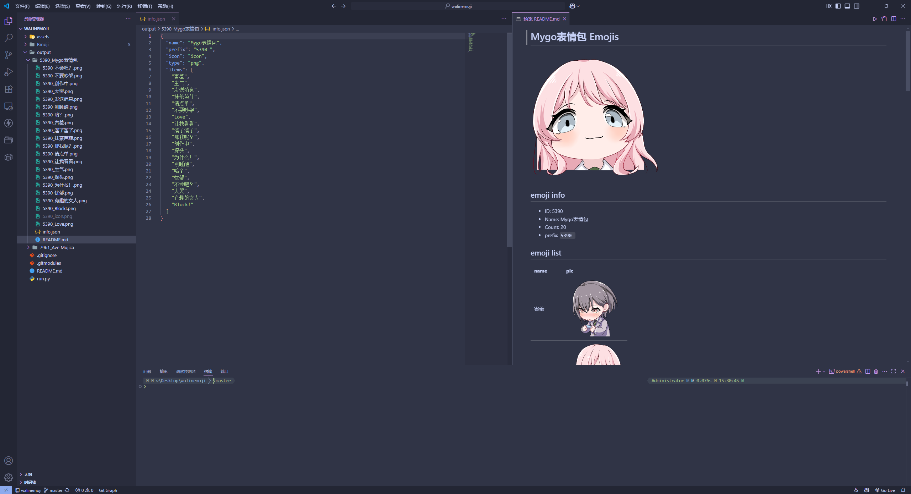

# Walinemoji 表情包下载与整理工具
> README由LLM生成，请注意鉴别

## 项目简介
本项目用于根据指定的**bilibili** 平台表情包ID，从本地数据源自动下载、整理并生成表情包文件夹，包含表情图片、表情包图标、info.json 及 README.md，方便管理和在waline中使用。

## 主要功能
- 根据表情包 ID 自动查找并下载所有表情图片
- **自动下载表情包官方图标文件**
- 自动生成包含表情包信息的 info.json 文件（使用预设图标）
- 自动生成带有预览和表格的 README.md 文件
- 支持批量处理多个表情包

## 生成的文件结构
每个下载的表情包会生成如下文件结构：
```
output/
└── {ID}_{表情包名称}/
    ├── {ID}_icon.png           # 表情包官方图标
    ├── {ID}_{表情名称}.png      # 各个表情图片
    ├── info.json               # 表情包信息文件
    └── README.md              # 表情包说明文档
```

## info.json 格式说明
生成的 info.json 文件格式如下：
```json
{
  "name": "表情包名称",
  "prefix": "ID_",
  "icon": "icon",
  "type": "png",
  "items": ["表情1", "表情2", "..."]
}
```

**重要更新**: 
- `icon` 字段现在使用统一的 "icon" 值，对应下载的 `{prefix}icon.png` 文件
- 这确保了与表情包官方图标的正确对应关系

**生成效果**


## 使用方法
1. 安装依赖：
   ```bash
   pip install requests
   ```
2. 运行主程序：
   ```bash
   python run.py
   ```
   或自定义调用 `download_emoji_package(target_id)` 函数

3. 修改目标表情包ID：
   在 `run.py` 文件末尾的 `__main__` 部分修改 `target_id` 变量值

## 目录结构
```
walinemoji/
├── run.py              # 主程序，包含下载与整理逻辑
├── Bmoji/
│   └── data/
│       └── emoji_data.json  # 表情包数据源
├── output/
│   └── {ID}_{表情包名称}/   # 自动生成的表情包文件夹
│       ├── {ID}_icon.png   # 表情包官方图标
│       ├── {ID}_{表情}.png # 各个表情图片
│       ├── info.json       # 表情包信息
│       └── README.md       # 表情包说明
└── README.md           # 项目说明文档
```

## 依赖说明
- Python 3.x
- requests

## 数据来源
本项目所用的 `emoji_data.json` 数据文件来源于项目：

> https://github.com/SakuraSenQwQ/Bmoji

该数据文件包含从 **bilibili** 平台爬取的表情包信息，包括表情包 ID、名称、图片 URL 等数据。项目会根据这些数据自动从 bilibili CDN (`https://i0.hdslb.com`) 下载对应的表情图片。

如需更新数据，请前往上述仓库获取最新版本。

## 致谢
感谢 Bmoji 项目及其贡献者提供的表情包数据支持。

